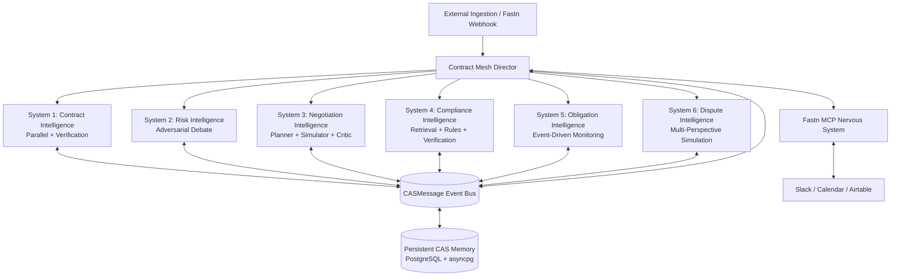

# Contract Agentic Society (CAS) - Architecture Specification

## 1. Executive Summary
The **Contract Agentic Society (CAS)** is an enterprise hackathon-grade autonomous multi-agent federation that manages the entire lifecycle of complex contracts. Rather than implementing a simplistic linear pipeline or conversational chatbot, CAS structures contract intelligence as a **Federation of Independent Multi-Agent Societies**, coordinated dynamically by a **Contract Mesh Director** and connected to the enterprise world through the **Fastn MCP nervous system**.

---

## 2. Federation Topology

---

## 3. Core Architectural Principles

### 3.1 Centralized Gemini Reasoning
- **Google Gemini API** (`gemini-2.5-flash`) is the **SOLE** LLM and reasoning provider across all agents and the Director.
- All LLM interactions are funneled through `backend/core/gemini_service.py` (`GeminiService`), which handles:
  - Structured output generation and Pydantic schema validation
  - Exponential backoff retries with self-repair prompts on schema errors
  - Temperature calibration (0.1 default for high fidelity legal reasoning)
  - Seamless fallback mocking for offline CI/CD test execution
- **Zero deterministic NLP replacement:** Python is strictly limited to deterministic orchestration, schema routing, arithmetic calculations, database operations, and state transitions. Gemini performs all cognitive reasoning, interpretation, adversarial debates, and strategic simulations.

### 3.2 Production Database & Test Runner Isolation
- **Production Database:** **PostgreSQL** via SQLAlchemy 2.0 with `asyncpg` async driver. Connection pooling, JSON columns with datetime serialization, and transactional isolation.
- **Automated Test Isolation:** An in-memory SQLite runner with `StaticPool` and `check_same_thread=False` is used exclusively when `TESTING=true`, guaranteeing zero interference with production environments and instantaneous test execution (< 3 seconds for the entire federation).

### 3.3 Standardized Communication Protocol (`CASMessage`)
Every inter-system communication is encapsulated in an immutable, validated `CASMessage` DTO:
- `event_id`: Unique UUIDv4
- `contract_id`: Traceable target contract identifier
- `source_system`: Emitting society
- `target_system`: Designated recipient or `"director"` / `"*"`
- `event_type`: Standard lifecycle event name (e.g. `CONTRACT_PARSED`, `RISK_EVALUATED`, `CONFLICT_DETECTED`)
- `payload`: Structured JSON domain findings
- `evidence_refs`: Verbatim clause / rule citations
- `confidence`: Calibrated statistical confidence score (0.0 to 1.0)
- `priority`: `LOW`, `MEDIUM`, `HIGH`, `CRITICAL`
- `timestamp`: ISO-8601 UTC timestamp

---

## 4. The Six Autonomous Multi-Agent Architectures

### System 1: Contract Intelligence (Parallel + Verification)
- **Architecture:** Concurrent decomposition followed by adversarial verification.
- **Agents:**
  1. `ClauseExtractor`: Identifies sections, clause types, unusual terms, and plain language summaries.
  2. `EntityExtractor`: Identifies contracting parties, roles, jurisdictions, governing laws, and effective dates.
  3. `ObligationExtractor`: Categorizes affirmative/negative duties, payment conditions, and frequencies.
  4. `DeadlineExtractor`: Identifies notice windows, cure periods, and auto-renewal triggers.
  5. `ContractStructureBuilder`: Assembles the normalized `ContractGraph`.
  6. `ContractCriticAgent`: Audits the extracted graph against source text to detect omissions or hallucinations.
- **Standalone Value:** Operates independently to normalize raw contract text into a structured, queryable Contract Knowledge Graph.

### System 2: Risk Intelligence (Adversarial Debate)
- **Architecture:** Multi-agent adversarial debate (Prosecution vs. Defense vs. Neutral Arbitration).
- **Agents:**
  1. `RiskHunter`: Aggressively surfaces potential legal, commercial, and operational exposures.
  2. `LegalReasoner`: Formulates formal legal arguments and damage scenarios.
  3. `CounterargumentAgent`: **CRITICAL REBUTTAL AGENT** that attacks hunter findings, arguing industry standards, commercial concessions, and mitigating circumstances to eliminate false positives.
  4. `EvidenceVerifier`: Validates that cited clauses exist verbatim in the contract.
  5. `SeverityAssessor`: Neutral arbitrator weighing prosecution vs. defense to establish calibrated Net Severity.
  6. `RiskSynthesizer`: Formulates actionable mitigations and executive risk reports.
- **Standalone Value:** Delivers balanced, defensible risk audits with zero unvetted alarms.

### System 3: Negotiation Intelligence (Planner + Simulator + Critic)
- **Architecture:** Strategic game-theoretic planning with counterparty simulation and adversarial critique.
- **Agents:**
  1. `NegotiationPlanner`: Establishes target positions, fallback boundaries, and non-negotiable red lines.
  2. `StrategyAgent`: Formulates opening moves, concessions, and tactical sequencing.
  3. `CounterpartySimulator`: Adopts opposing counterparty persona (e.g. Vendor Legal) to simulate counter-demands and rejection likelihood.
  4. `ConcessionAgent`: Bundles commercial trade-offs (e.g. annual prepay in exchange for liability cap).
  5. `GameTheorist`: Models Nash equilibria, BATNA, and Zone of Possible Agreement (ZOPA).
  6. `StrategyCritic`: Identifies strategic vulnerabilities and unrealistic expectations.
  7. `FinalNegotiationAdvisor`: Synthesizes final actionable redline markup with exact clause text.
- **Standalone Value:** Generates commercial redlines and negotiation playbooks ready for executive deployment.

### System 4: Compliance Intelligence (Retrieval + Rules + Verification)
- **Architecture:** Policy retrieval with deterministic condition matching and Gemini contextual interpretation.
- **Design Rule:** Deterministic logic handles *only* explicit policy conditions; Gemini performs all contextual interpretation, carve-out evaluations, and conflict reasoning.
- **Agents:**
  1. `PolicyRetriever`: Ingests and indexes corporate compliance policies.
  2. `RuleMatcher`: Deterministically matches candidate policy rules against relevant sections.
  3. `ComplianceAnalyzer`: Contextually evaluates compliance status (`COMPLIANT`, `VIOLATION`, `AMBIGUOUS`).
  4. `ComplianceConflictDetector`: Identifies internal contradictions between clauses and policy standards.
  5. `ComplianceEvidenceAgent`: Verifies contractual evidence citations for each finding.
  6. `ComplianceCritic`: Verifies audit defensibility and prevents regulatory hallucination.
  7. `FinalComplianceAuditor`: Compiles the unified `ComplianceReport`.
- **Standalone Value:** Delivers regulatory and policy audits for vendor onboarding and internal governance.

### System 5: Obligation Intelligence (Event-Driven Monitoring)
- **Architecture:** Post-signature operational lifecycle tracking with temporal projection and SLA alerting.
- **Agents:**
  1. `ObligationItemExtractor`: Extracts recurring payments, deliverable milestones, and renewal notice windows.
  2. `DependencyAnalyzer`: Analyzes prerequisite triggers between obligations.
  3. `DeadlinePlanner`: Projects exact calendar deadlines from effective dates.
  4. `ObligationMonitoringAgent`: Simulates time ticks, flagging due-soon, overdue, and upcoming commitments.
  5. `ObligationEscalationAgent`: Identifies impending breach risks.
  6. `ObligationReporter`: Compiles comprehensive operational schedules.
- **Standalone Value:** Post-signature compliance and operational milestone tracker.

### System 6: Dispute Intelligence (Multi-Perspective Simulation)
- **Architecture:** Polarized perspective simulation and operational conflict modeling.
- **Agents:**
  1. `AmbiguityDetector`: Surfaces vague standards ("commercially reasonable efforts") and latent conflicts.
  2. `PartyAInterpreter`: Interprets ambiguities maximizing Customer protection.
  3. `PartyBInterpreter`: Interprets ambiguities maximizing Vendor liability shields.
  4. `ConflictSimulator`: Models high-stakes crisis scenarios where interpretations collide into open dispute.
  5. `ResolutionStrategist`: Formulates preventative drafting redlines and dispute resolution playbooks.
  6. `DisputeCritic`: Calibrates conflict realism and overall dispute risk index.
- **Standalone Value:** Predicts and prevents litigation before contract execution.

---

## 5. Dynamic Director & Conflict Resolution
The **Contract Mesh Director** (`CASDirector`) coordinates the federation dynamically:
- **Phase A:** Evaluates input contract and commercial objectives to dynamically determine which societies to activate.
- **Phase B:** Dispatches concurrent analysis to Risk, Compliance, and Dispute systems using shared Contract Graph.
- **Phase C:** Ingests findings into Negotiation Intelligence to formulate unified redline strategy.
- **Phase D:** Runs **Bidirectional Cross-Society Feedback Loops**:
  - Risk findings update Negotiation positions.
  - Compliance violations inject mandatory redlines.
  - Dispute scenarios elevate Risk severity ratings.
- **Phase E:** Detects and arbitrates cross-subsystem clashes (e.g. Risk demands striking a clause that Negotiation wants as commercial leverage).
- **Phase F:** Dispatches Human-In-The-Loop escalation requests via Fastn Slack webhook when unresolved conflicts exceed tolerance.

---

## 6. Fastn MCP Nervous System
All external interactions flow through **Fastn Workflows**:
- `cas-contract-intake` (`wf_0c61baf31b93`): External document ingestion via webhook.
- `cas-risk-escalation` (`wf_7330f03b75f6`): High-severity risk escalation.
- `cas-approval-dispatch` (`wf_5ccc14b11936`): Human approval dispatching.
- `cas-obligation-sync` (`wf_2783a17803cc`): Google Calendar and Airtable deadline syncing.
- `cas-renewal-monitor` (`wf_ef794f8dd239`): Scheduled renewal window notifications.
